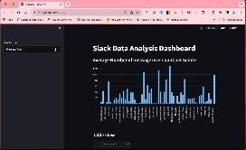

# Slack Messages Analysis

## Demo 


## Overview 🚀

Slack Messages Analysis is designed to assess candidates for the 12-week training program in Data Engineering and Machine Learning Engineering. This project provides applicants with hands-on experience in real-world tasks within these domains, aiding 10 Academy in selecting suitable candidates.

### Goal to Hit 🎯
  - Patterns of users' messaging behavior.
  - Patterns of replies and reactions of users to messages posted by both peers and admins.
  - Discover sub-communities by building network graphs of message senders and those who reply or react to those messages.


## Table of Contents

- [Installation](#installation)
  - [Creating a Virtual Environment](#creating-a-virtual-environment)
  - [Clone this package](#clone-this-package)
- [Usage](#usage)
  - [Configuration](#configuration)
  - [Data Loading](#data-loading)
  - [Utilities](#utilities)
- [Testing](#testing)
- [Documentation](#documentation)
- [Notebooks](#notebooks)
- [Contributing](#contributing)
- [Acknowledgments](#acknowledgments)
- [License](#license)

## Installation

### Creating a Virtual Environment

#### Using Conda 🐍

If you prefer Conda as your package manager:

1. Open your terminal or command prompt.
2. Navigate to your project directory.
3. Run the following command to create a new Conda environment:

   ```bash
   conda create --name your_env_name python=3.12
    ```
    Replace `your_env_name` with the desired name for your environment e.g. week0 and `3.12` with your preferred Python version.

4. Activate the environment:

    ```bash
    conda activate your_env_name
    ```

#### Using Virtualenv

If you prefer using `venv`, Python's built-in virtual environment module:

1. Open your terminal or command prompt.

2. Navigate to your project directory.

3. Run the following command to create a new virtual environment:

    ```bash
    python -m venv your_env_name
    ```

    Replace `your_env_name` with the desired name for your environment.

4. Activate the environment:

    - On Windows:

    ```bash
    .\your_env_name\scripts\activate
    ```

    - On macOS/Linux:

    ```bash
    source your_env_name/bin/activate
    ```

Now, your virtual environment is created and activated. You can install packages and run your Python scripts within this isolated environment. Don't forget to install required packages using `pip` or `conda` once the environment is activated.

### Clone this package

To install the `network_analysis` package, follow these steps:

1. Clone the repository:
    ```bash
    git clone https://github.com/Azizadx/nasrallah-week0_10academy.git
    ```
2. Navigate to the project directory:
    ```bash
    cd nasrallah-week0_10academy
    ```
 
3. Install the required dependencies:
    ```bash
    pip install -r requirements.txt
    ```

Please be aware that the existing requirements.txt file includes only a limited set of packages at the moment, and it might not encompass all the necessary packages for your analysis. Make sure to supplement it with any additional packages you plan to install.

## Usage
### Configuration
Configure the package by modifying the `src/config.py` file. Adjust parameters such as file paths, API keys, or any other configuration settings relevant to your use case.

### Data Loading
The package provides a data loader module (`loader.py`) in the src directory. Use this module to load your network data into a format suitable for analysis.

Example:

```python
from src.loader import DataLoader

# Initialize DataLoader
data_loader = DataLoader()

# Load data from a Slack channel
slack_data = data_loader.load_slack_data("path/to/slack_channel_data")
```

## Utilities
Explore the various utilities available in the `src/utils.py` module. This module contains functions for common tasks such as data cleaning, preprocessing, and analysis.

Example:

```python
from src.utils import clean_data, visualize_network

# Clean the loaded data
cleaned_data = clean_data(slack_data)

# Visualize the network
visualize_network(cleaned_data)
```

## Testing
Run tests using the following command:

```bash
make test
```

This will execute the unit tests located in the tests directory.

## Documentation
Visit the docs directory for additional documentation and resources. The documentation covers important aspects such as code structure, best practices, and additional usage examples.
### Database Schema Design 🗄️

The project employs a well-thought-out database schema to organize and manage the data efficiently. Below is an overview of the key tables and relationships within the database:

#### User Table

- `user_id`: Unique identifier for each user.
- `username`: User's username.
- `email`: User's email address.
- ...

#### Message Table

- `message_id`: Unique identifier for each message.
- `user_id`: Foreign key referencing the `user_id` in the User table.
- `channel_id`: Identifier for the Slack channel.
- `timestamp`: Timestamp indicating when the message was sent.
- `content`: The content of the message.
- ...

#### Reaction Table

- `reaction_id`: Unique identifier for each reaction.
- `message_id`: Foreign key referencing the `message_id` in the Message table.
- `user_id`: Foreign key referencing the `user_id` in the User table.
- `reaction_type`: Type of reaction (e.g., thumbs up, smiley face).

Feel free to refer to the detailed schema documentation in the [`docs/database_schema.md`](docs/database_schema.md) file for more information.

## Notebooks
The notebooks directory contains Jupyter notebooks that demonstrate specific use cases and analyses. Refer to these notebooks for hands-on examples.

## Contributing
Contributions are welcome! Before contributing, please review our contribution guidelines.

## 🙌 Want to Contribute or Report an Issue?

Your contributions and feedback are highly valued! Here are ways you can get involved:

- 🐛 **Report an Issue:** Found a bug or want to suggest an improvement? [Open an issue](../../issues/) and let us know. We appreciate detailed reports that help us understand and resolve the problem.

- 🌟 **Contribute:** Ready to contribute to the project? Check out our [contribution guidelines](CONTRIBUTING.md) to get started. We welcome your ideas, bug fixes, and feature enhancements.

Thank you for your interest in making this project better! 🚀

## Acknowledgments 🙌
I am immensely grateful to the [10 Academy team](https://github.com/10xac) for providing me with this incredible opportunity to explore and deepen my knowledge in the fields of AI and data. 🌟 This journey has been invaluable, and I appreciate the support and guidance received.

##  License
This project is licensed under the MIT License.


